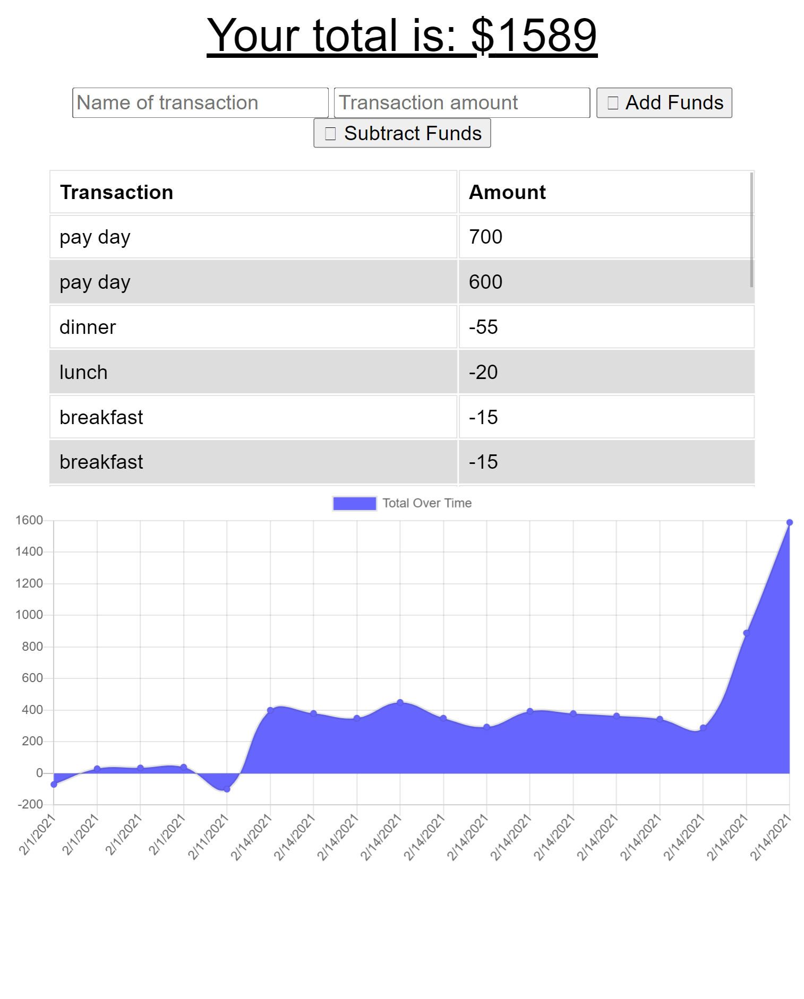

# Budget_Tracker

## Acceptance Criteria
GIVEN a user is on Budget App without an internet connection
WHEN the user inputs a withdrawal or deposit
THEN that will be shown on the page, and added to their transaction history when their connection is back online.

## Discription:

Budget Tracker is a full stack application that uses Express and MongoDB to track a user's expenses. The application provides offline functionality which allows users to keep track of their expenses even if they are out of network and not able to connect. Users will be able to enter any expendatures offline and their data will be cached. Once back online the cached data will then get added to the server and officially stored. The interface will track all enteries and will be updated once the user is back online. Majority of the code was provided, our task was to add the offline functionality by added the service-worker file, webmanifest file and the db.js file. 

## Table of Contents

- [Usage](#usage)
- [Installation](#installation)
- [Screenshot](#screenshot)
- [Skills](#skills)
- [License](#license)
- [Resources](#resources)

## Usage

Usage of this app is for any person interested in tracking their expenses on a day to day basis or while traveling without connection to internet. 

## Installation

Users may access the application via the site below:
https://frozen-citadel-13149.herokuapp.com/ 

Users or other programmers can download the repo to their own machine. Be sure to run "npm i" to pull down required packages. MongoDB will also need to be installed if not already. 

## Screenshot

## Skills

## License

License Documentation: (https://opensource.org/licenses/AFL-3.0)

## Resources
* Week 17 mini project
* Week 18 activities
* Stack overflow

 ## Questions
  * If you have any questions please feel free to email me or stop by on my GitHub! 
  * Find me on GitHub: (https://github.com/dbailey11/)
  * Email me: baileydevyn19@gmail.com
